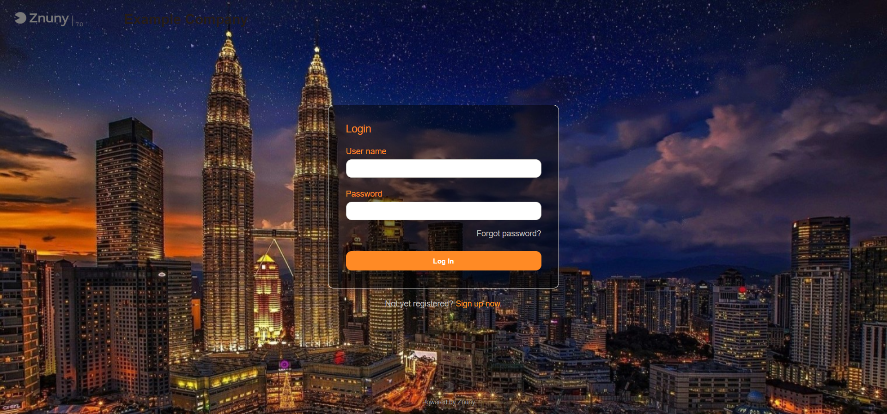

# Znuny-Customer-Login-Background
- Show customer login background (image)
- Based on Znuny 7.0.x
 
1. Upload your image at /opt/znuny/var/httpd/htdocs/skins/Customer/default/img/
2. Update **Admin > System Configuration > CustomerLoginBackground**
3. To change forms background color, text header color and label color, check **Admin > System Configuration > CustomerLoginBackgroundColor**  
	
		ContainerBackgroundColor = color of the lcontainer (login / reset / register form)
		TextHeaderColor = color of the h2 text header (login / reset / register form)
		LabelColor = color of the label.

